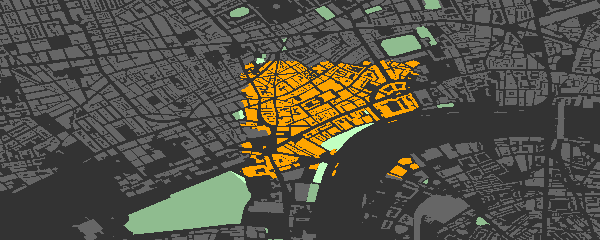
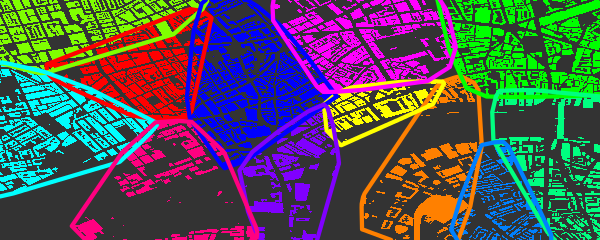
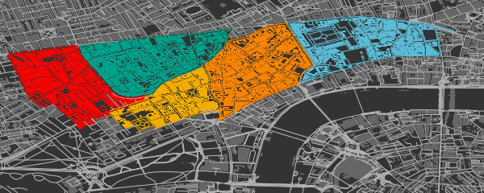

osmplotr
========

[](https://travis-ci.org/mpadge/osmplotr) [](http://cran.r-project.org/package=osmplotr) [](http://cran.r-project.org/package=osmplotr)


R package to produce visually impressive customisable images of urban areas from OpenStreetMap (OSM) data, using data downloaded from the [overpass api](http://overpass-api.de/). The above map shows building polygons for a small portion of central London, U.K., and was made with the following easy steps:

1.  Specify the bounding box for the desired region

    ``` r
    bbox <- c(-0.15,51.5,-0.1,51.52) 
    ```

2.  Download the desired data---in this case, all building perimeters.

    ``` r
    dat_B <- extract_osm_objects (key="building", bbox=bbox)$obj
    ```

3.  Initiate an `osm_basemap` with desired background (`bg`) colour

    ``` r
    plot_osm_basemap (xylims=get_xylims (bbox), bg="gray20", file="map1.png")
    ```

4.  Overlay objects on plot in the desired colour.

    ``` r
    add_osm_objects (dat_B, col="gray40")
    ```

5.  Close graphics device to finish

    ``` r
    graphics.off ()
    ```

Installation
------------

``` r
install.packages ('osmplotr')
```

or the development version

``` r
devtools::install_github ('mpadge/osmplotr')
```

A simple map
------------

Simple maps can be made by overlaying different kinds of OSM data in different colours:

``` r
dat_H <- extract_osm_objects (key="highway", bbox=bbox)$obj
dat_P <- extract_osm_objects (key="park", bbox=bbox)$obj
dat_G <- extract_osm_objects (key="landuse", value="grass", bbox=bbox)$obj
```

``` r
plot_osm_basemap (xylims=get_xylims (bbox), bg="gray20", file="map2.png")
add_osm_objects (dat_B, col="gray40")
add_osm_objects (dat_H, col="gray80")
add_osm_objects (dat_P, col="darkseagreen")
add_osm_objects (dat_G, col="darkseagreen1")
graphics.off ()
```


Highlighting selected areas
---------------------------

`osmplotr` is primarily intended as a data visualisation tool, particularly through enabling selected regions to be highlighted. Regions can be defined according to simple point boundaries:

``` r
pts <- sp::SpatialPoints (cbind (c (-0.128, -0.138, -0.138, -0.128),
                             c (51.502, 51.502, 51.515, 51.515)))
```

and OSM objects within the defined regions highlighted with different colour schemes. The `col_extra` parameter defines the colour of the remaining, background area.

``` r
plot_osm_basemap (xylims=get_xylims (bbox), bg="gray20", file="map3.png")
add_osm_groups (dat_B, groups=pts, col="orange", col_extra="gray40", 
                   colmat=FALSE, boundary=1)
add_osm_objects (london$dat_P, col="darkseagreen1")
add_osm_groups (london$dat_P, groups=pts, col='darkseagreen1',
                   col_extra='darkseagreen', colmat=FALSE, boundary=0)
graphics.off ()
```



Or may highlighted in dark-on-light:

``` r
plot_osm_basemap (xylims=xylims, bg="gray95", file="map4.png")
add_osm_groups (dat_B, groups=pts, col="gray40", col_extra="gray85",
                   colmat=FALSE, boundary=1)
add_osm_groups (dat_H, groups=pts, col="gray20", col_extra="gray70",
                   colmat=FALSE, boundary=0)
add_osm_groups (dat_HP, groups=pts, col="gray10", col_extra="white",
                   colmat=FALSE, boundary=0)
graphics.off ()
```


### Highlighting clusters

`add_osm_groups` also enables plotting an entire region as a group of spatially distinct clusters of defined colours. The argument `groups` in the following call is a list of `SpatialPoints` objects defining 12 small, spatially separated regions. Calling `add_osm_groups` with `col_extra=NA` (or `NULL`) forces all points lying outside those defined groups to be allocated to the nearest groups, and thus produces an inclusive grouping extending across an entire area.

``` r
plot_osm_basemap (xylims=get_xylims (bbox), bg='gray20', file='map5.png')
add_osm_groups (dat_B, groups=groups, col_extra=NA, make_hull=FALSE,
                   colmat=TRUE, lwd=3)
graphics.off ()
```



### Highlighting areas bounded by named highways

An alternative way of defining highlighted groups is by naming the highways encircling desired regions.

``` r
highways <- c ('Davies.St', 'Berkeley.Sq', 'Berkeley.St', 'Piccadilly',
               'Regent.St', 'Oxford.St')
highways1 <- highways2polygon (highways=highways, bbox=bbox)
highways <- c ('Regent.St', 'Oxford.St', 'Shaftesbury')
highways2 <- highways2polygon (highways=highways, bbox=bbox)
highways <- c ('Piccadilly', 'Shaftesbury.Ave', 'Charing.Cross.R',
               'Saint.Martin', 'Trafalgar.Sq', 'Cockspur.St',
               'Pall.Mall', 'St.James')
highways3 <- highways2polygon (highways=highways, bbox=bbox)
highways <- c ('Charing.Cross', 'Duncannon.St', 'Strand', 'Aldwych',
               'Kingsway', 'High.Holborn', 'Shaftesbury.Ave')
highways4 <- highways2polygon (highways=highways, bbox=bbox)
highways <- c ("Kingsway", "Holborn", "Farringdon.St", "Strand",
               "Fleet.St", "Aldwych")
highways5 <- highways2polygon (highways=highways, bbox=bbox)
groups <- list (highways1, highways2, highways3, highways4, highways5)
```

And then passing the SpatialPolygon returned by `highways2polygon` to `add_osm_groups`, this time with some Wes Anderson flair.

``` r
plot_osm_basemap (xylims=get_xylims (bbox), bg='gray20', file='map6.png')
library (wesanderson)
cols <- wes_palette ("Darjeeling", 5) 
add_osm_groups (dat_B, groups=groups, boundary=1,
                   col_extra='gray40', colmat=FALSE, col=cols)
add_osm_groups (dat_H, groups=groups, boundary=0,
                   col_extra='gray70', colmat=FALSE, col=cols)
graphics.off ()
```



See package vignettes ('Downloading Data' and 'Making Maps') for a lot more detail and further capabilities of `osmplotr`.

### Data surfaces

Finally, `osmplotr` contains a function `add_osm_surface` to spatially interpolate a given set of spatial data points and colour OSM objects according to a specified colour gradient. This is illustrated here with a surface laid on regular points interior to `bbox`.

``` r
x <- seq (-0.145, -0.105, by=0.005)
y <- seq (51.502, 51.518, by=0.002)
xarr <- array (x, dim=c(length (x), length (y)))
yarr <- t (array (y, dim=c(length (y), length (x))))
z <- sin (100 * (xarr + 0.125)) + cos (100 * (yarr - 51.51) - 1)
surf <- cbind (as.numeric (xarr), as.numeric (yarr), as.numeric (z))
```

Passing the `bg` argument to `add_osm_surface` plots all objects beyond the convex hull of the `xy` points as that colour. (Such points may be included in the interpolation with `bg=NULL`.)

``` r
plot_osm_basemap (xylims=get_xylims (bbox), bg="gray20", file='map7.png')
add_osm_surface (dat_B, dat=surf, method="idw", bg="gray40")
cols <- adjust_colours (terrain.colors (30), -0.2) # Darken by ~20%
add_osm_surface (dat_H, dat=surf, cols=cols, bg="gray40")
graphics.off ()
```


