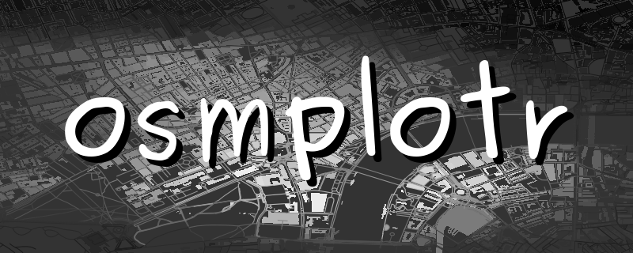

osmplotr [](https://travis-ci.org/mpadge/osmplotr)
==========================================================================================================================

R package to produce visually impressive customisable images of urban areas from OpenStreetMap (OSM) data, using data downloaded from the [overpass api](http://overpass-api.de/). This map shows building polygons for a small portion of central London, U.K., and was made with the following easy steps:



1.  Specify the bounding box for the desired region

``` r
bbox <- c(-0.15,51.5,-0.1,51.52) 
```

2.  Download the desired data---in this case, all building perimeters.

``` r
dat_B <- extract_osm_objects (key="building", bbox=bbox)
```

3.  Initiate an `osm_basemap` with desired background (`bg`) colour

``` r
plot_osm_basemap (xylims=get_xylims (bbox), bg="gray20", file="map1.png")
```

4.  Overlay objects on plot in the desired colour.

``` r
add_osm_objects (dat_B, col="gray40")
```

5.  Close graphics device to finish

``` r
graphics.off ()
```

A simple map
------------

Simple maps can be made by overlaying different kinds of OSM data in different colours:

``` r
dat_H <- extract_osm_objects (key="highway", bbox=bbox)
dat_P <- extract_osm_objects (key="park", bbox=bbox)
dat_G <- extract_osm_objects (key="landuse", value="grass", bbox=bbox)
```

``` r
plot_osm_basemap (xylims=get_xylims (bbox), bg="gray20", file="map2.png")
add_osm_objects (dat_B, col="gray40")
add_osm_objects (dat_H, col="gray80")
add_osm_objects (dat_P, col="darkseagreen")
add_osm_objects (dat_G, col="darkseagreen1")
graphics.off ()
```


Highlighting selected areas
---------------------------

`osmplotr` is primarily intended as a data visualisation tool, particularly through enabling selected regions to be highlighted. Regions can be defined according to simple point boundaries:

``` r
pts <- sp::SpatialPoints (cbind (c (-0.128, -0.138, -0.138, -0.128),
                             c (51.502, 51.502, 51.515, 51.515)))
```

and OSM objects within the defined regions highlighted with different colour schemes. The `col_extra` parameter defines the colour of the remaining, background area.

``` r
plot_osm_basemap (xylims=get_xylims (bbox), bg="gray20", file="map3.png")
group_osm_objects (dat_B, groups=pts, col="orange", col_extra="gray40", 
                   colmat=FALSE, boundary=1)
add_osm_objects (london$dat_P, col="darkseagreen1")
group_osm_objects (london$dat_P, groups=pts, col='darkseagreen1',
                   col_extra='darkseagreen', colmat=FALSE, boundary=0)
graphics.off ()
```


Or may highlighted in dark-on-light:

``` r
plot_osm_basemap (xylims=xylims, bg="gray95", file="map4.png")
group_osm_objects (dat_B, groups=pts, col="gray40", col_extra="gray85",
                   colmat=FALSE, boundary=1)
group_osm_objects (dat_H, groups=pts, col="gray20", col_extra="gray70",
                   colmat=FALSE, boundary=0)
group_osm_objects (dat_HP, groups=pts, col="gray10", col_extra="white",
                   colmat=FALSE, boundary=0)
graphics.off ()
```


### Highlighting clusters

`group_osm_objects` also enables plotting an entire region as a group of spatially distinct clusters of defined colours. First define some random groups:

``` r
ngroups <- 12
x <- bbox [1] + runif (ngroups) * (bbox [3] - bbox [1])
y <- bbox [2] + runif (ngroups) * (bbox [4] - bbox [2])
groups <- cbind (x, y)
groups <- apply (groups, 1, function (i) 
              sp::SpatialPoints (matrix (i, nrow=1, ncol=2)))
# Then create small rectangles around each pts
groups <- lapply (groups, function (i)
               {
                   x <- sp::coordinates (i) [1] + c (-0.002, 0.002, 0.002,
                                                     -0.002)
                   y <- sp::coordinates (i) [2] + c (-0.002, -0.002, 0.002,
                                                     0.002)
                   sp::SpatialPoints (cbind (x, y))
               })
```

Calling `group_osm_objects` with `col_extra=NA` (or `NULL`) forces all points lying outside defined groups to be allocated to the nearest groups, and thus produces an inclusive grouping extending across an entire area.

``` r
plot_osm_basemap (xylims=get_xylims (bbox), bg='gray20', file='map5.png')
group_osm_objects (dat_B, groups=groups, col_extra=NA, make_hull=FALSE,
                   colmat=TRUE, lwd=3)
graphics.off ()
```


### Highlighting areas bounded by named highways

An alternative way of defining highlighted groups is by naming the highways encircling desired regions.

``` r
highways <- c ("Kingsway", "Holborn", "Farringdon.St", "Strand",
               "Fleet.St", "Aldwych")
highways1 <- highways2polygon (highways=highways, bbox=bbox)
highways <- c ('Regent.St', 'Oxford.St', 'Shaftesbury')
highways2 <- highways2polygon (highways=highways, bbox=bbox)
groups <- list (highways1, highways2)
```

and then passing the SpatialPolygon returned by `highways2polygon` to `group_osm_objects`:

``` r
plot_osm_basemap (xylims=get_xylims (bbox), bg='gray20', file='map6.png')
col_B <- c ('orange', 'tomato')
col_H <- c ('darkorange2', 'tomato3')
group_osm_objects (dat_B, groups=groups, boundary=1,
                   col_extra='gray40', colmat=FALSE, col=col_B)
group_osm_objects (dat_H, groups=groups, boundary=0,
                   col_extra='gray70', colmat=FALSE, col=col_H)
graphics.off ()
```


... see package vignette for a lot more detail and further capabilities.
